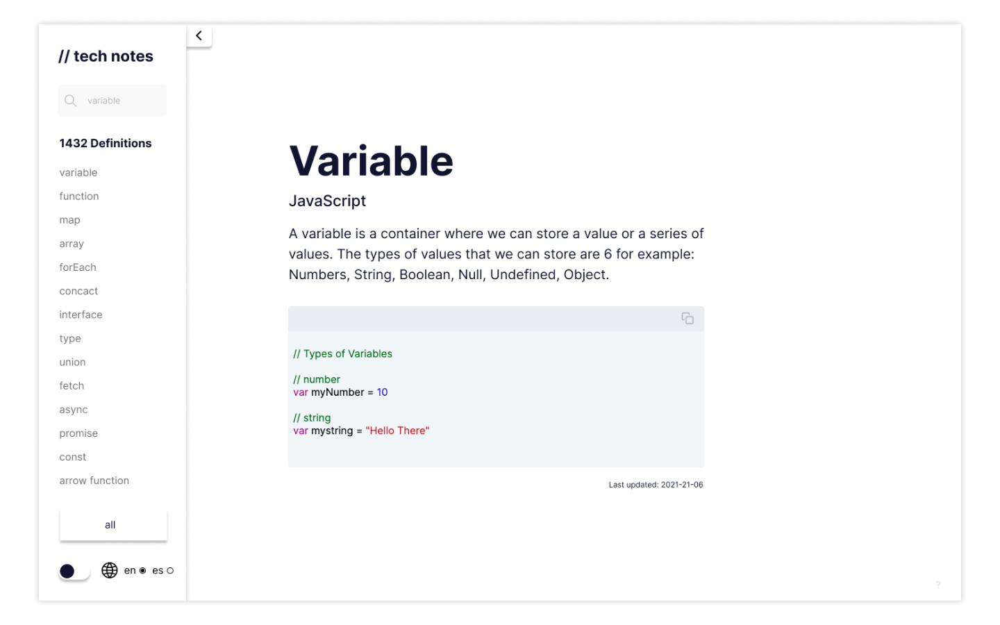
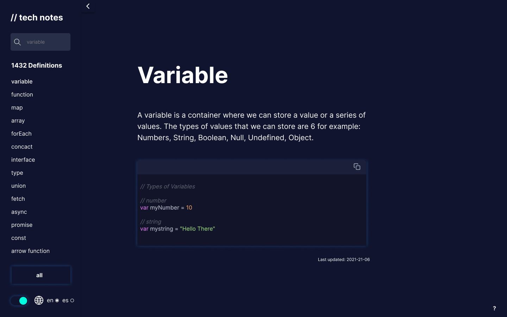

<br />
<p align="center">
  <a href="https://tech-notes.dev/" target="_blank">
    
  </a>

  <h3 align="center">Tech Notes</h3>

  <p align="center">
    Minimalist Documentation
    <br />
    <br />
    <a href="https://tech-notes.dev/">View Demo</a>
    ·
    <a href="https://github.com/oscarbebop/tech-notes/issues">Report Bug</a>
    ·
    <a href="https://github.com/oscarbebop/tech-notes/issues">Request Feature</a>
  </p>
</p>

## About The Project



Tech Notes is an alternative to traditional documentation.

The idea behind this project is to provide a simple and quick reference to a programming language, framework or library.

This project is not intended to replace any documentation, but to be an alternative that helps developers to solve doubts with short examples and simple examples.

## Characteristics

### Dark Theme



Currently the project has a dark theme built in and can be easily changed with a toggle

### Support for multiple languages

**English and Spanish** for the moment. The idea behind the project is to make it accessible to as many people as possible. If you want to contribute by implementing a new language please check the contributions section at the bottom of this document

## Stack

Tech Notes is developed on a [JAM Stack](https://jamstack.org/). These are the technologies that mainly compose it:

- [React](https://reactjs.org/)
- [Gatsby](https://www.gatsbyjs.com/)
- [TypeScript](https://www.typescriptlang.org/)
- [GraphQL](https://graphql.org/)
- [Sanity](https://www.sanity.io/)

If you want to know all the libraries that make up this project you can go to the acknowledgments section at the end of this document

## Getting Started

If you want to clone this repository and run it locally, you must bear in mind that you must place the [sanity.io](https://www.sanity.io/) keys to correctly load the data. Or you can clone it just to see its operation and structure

Having said that, let's move on to the installation

### Prerequisites

To run this project it is necessary to have [NodeJS](https://nodejs.org/en/) version 14 or higher installed on your machine as well as to have [GatsbyJS](https://www.gatsbyjs.com/get-started/) installed.

### Installation

1. Clone the repo
   ```sh
   git clone https://github.com/oscarbebop/tech-notes.git
   ```
2. Install NPM packages
   ```sh
   npm install
   ```
3. Create an account and project on [sanity.io](https://www.sanity.io/)
4. Create a `.env` file in the root folder with the keys
5. Enter your API in `config.js`
   ```
   SANITY_PROJECT_ID=YOUR_PROYECT_ID
   SANITY_TOKEN=YOUR_SANITY_TOKEN
   ```

## Contributing

I would like more people to be able to contribute to the development of this repository or help me integrate more languages.

If you want to contribute you can follow the following steps

1. Fork the Project
2. Create your Feature Branch (`git checkout -b feature/AmazingFeature`)
3. Commit your Changes (`git commit -m 'Add some AmazingFeature'`)
4. Push to the Branch (`git push origin feature/AmazingFeature`)
5. Open a Pull Request

## License

Distributed under the MIT License. See `LICENSE` for more information.

## Contact

If you want to contact me you can do it through my twitter account

Twitter - [@oscarbebop](https://twitter.com/oscarbebop)

## Acknowledgements

There are many external libraries which helped me a lot in creating this project. In this section I will include all the ones I used.

- [Best README Template - Github Template](https://github.com/othneildrew/Best-README-Template)
- [Windows size - Detect screen size](https://www.npmjs.com/package/@react-hook/window-size)
- [Sanity Block Content - Sanity content manager](https://github.com/sanity-io/block-content-to-react)
- [Styled Components - Styles as React components](https://styled-components.com/)
- [Dotenv - management of environment variables](https://www.npmjs.com/package/dotenv)
- [React Clipboard - copy a text to the clipboard](https://www.npmjs.com/package/react-copy-to-clipboard)
- [React Helmet - handles the SEO of the site](https://www.npmjs.com/package/react-helmet)
- [React Icons - Icons as React components](https://react-icons.github.io/react-icons/)
- [React Syntax highlighter - Format the text type code](https://www.npmjs.com/package/react-syntax-highlighter)
- [Spacetime - date-calculator](https://www.npmjs.com/package/spacetime)
- [Gatsby Webfonts - Manage typography from google fonts](https://www.gatsbyjs.com/plugins/gatsby-plugin-webfonts/)
- [Graphql codegen - Generate the typescript typing for the querys](https://www.graphql-code-generator.com/)
